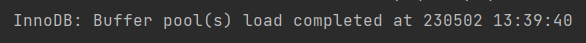

## About this project

This is an application that shows city bike journeys and city bike stations in Espoo and Helsinki.

In this  app you can browse through journeys, filter journeys based on departure and return station, browse stations, search for stations and click on stations to see more data about them.

I created this app as a pre-assignment for Solita Dev Academy (https://github.com/solita/dev-academy-2023-exercise).

## Instructions

### Prerequisites
Docker 
* https://docs.docker.com/get-docker/

Node.js 
* https://nodejs.org/en (I used 18.12.1)

### Install dependencies

First you need to clone this repository. After cloning the repository you have to set up the backend and frontend separately.

Run following commands:
```shell
cd backend/
npm install
```
Run following commands:
```shell
cd frontend/
npm install
```

### Download data

Download journey data from:
* https://dev.hsl.fi/citybikes/od-trips-2021/2021-05.csv
* https://dev.hsl.fi/citybikes/od-trips-2021/2021-06.csv
* https://dev.hsl.fi/citybikes/od-trips-2021/2021-07.csv

Download station data from:
* https://opendata.arcgis.com/datasets/726277c507ef4914b0aec3cbcfcbfafc_0.csv

When you have downloaded all data you have to put the files into the `backend/db` folder! 

Note: Save the journey data with the default names e.g. 2021.05.csv. However, if you decide to change the name you have to change the name in the script file as well.


### Run application

To run database, use the following commands:
``` shell
cd backend/
docker-compose up
```
It will take around 1 minute to import data to the MariaDB instance depending on your hardware. Once it is done, you should get this text in your terminal: 

When the data import is done, run backend:
``` shell
cd backend/
npm start
```

To run frontend, use following commands:
``` shell
cd frontend/
npm start
```

Once frontend is running go to http://localhost:3000

Once you are done, stop services. Database can be destroyed using:
```shell
docker-compose down
```


## Notes

* Helsinki fields in the data are empty, could fill these if needed.
* Data is duplicated in each file, so I deleted half of the rows in each of the data files (ignoring rows during journeys data import).
* Date in data is "the wrong way around" (newest to oldest, next month newest to oldest again etc) so I had to create a script that turns them around. The purpose of this was to get the ids in descending order.

## Technologies

* **Typescript** - I chose typescript for frontend and backend because I'm most familiar with it and I prefer using it over javascript.
* **MariaDB** - This one I chose because I think it is easy to use and I have previous experience from using it together with docker.
* **React** - I like react and thought it is the easiest way for me to build a frontend efficiently.
* **Docker** - I wanted to use docker because it is a fast and convenient way to get my database up and running.


* **ExpressJS** - This is the only tech I'm familiar with in how to make REST API. 
* **Axios** - Only HTTP client I'm familiar with.
* **React Bootstrap** - My favorite UI library.
* **Date-fns** - Makes handling dates easier.

## To do

* Possibility to add stations
* Possibility to add journeys
* Make the query functions cleaner
* More statistics when viewing single station
* Pagination pages